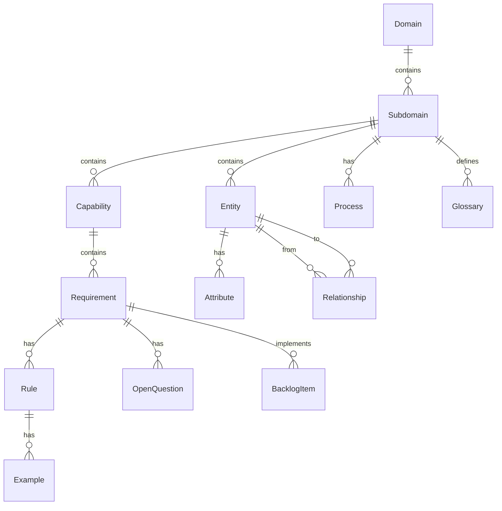

# Requirements Domain

This domain covers the product management data model used in the Airtable base.

## Requirements Hierarchy

The primary hierarchy for requirements visualization:

```
Domain → Subdomain → Capability → Requirement
```

## Entity Relationship Diagram



## Hierarchy

```
Domain (top-level area)
└── Subdomain (sub-area with 3-letter prefix)
    ├── Capability (functional grouping with 3-letter prefix)
    │   └── Requirement (BDD requirement, ReqID: SUB-CAP-NNN)
    │       ├── Rule (business rule)
    │       │   └── Example (concrete example for rule)
    │       ├── OpenQuestion (unresolved question)
    │       └── BacklogItem (prioritized work item)
    ├── Entity (business object)
    │   ├── Attribute (property with datatype)
    │   └── Relationship (connection to other entities)
    ├── Process (workflow with trigger and steps)
    └── Glossary (term definitions)
```

## Airtable Base

- **Base ID**: `appNiuZvIRl0rk1JC`
- **Base Name**: Product Management

## Tables

| Table | Description |
|-------|-------------|
| [Domain](entities/domain.md) | Top-level domain areas |
| [Subdomain](entities/subdomain.md) | Sub-areas with 3-letter prefix |
| [Capability](entities/capability.md) | Functional groupings with 3-letter prefix |
| [Entity](entities/entity.md) | Domain entities (business objects) |
| [Attribute](entities/attribute.md) | Entity properties and datatypes |
| [Relationship](entities/relationship.md) | Entity connections with cardinality |
| [Requirement](entities/requirement.md) | BDD requirements with MoSCoW prioritization |
| [Rule](entities/rule.md) | Business rules for requirements |
| [Example](entities/example.md) | Concrete examples for rules |
| [BacklogItem](entities/backlog-item.md) | Product backlog items |
| [Process](entities/process.md) | Business processes and workflows |
| [Glossary](entities/glossary.md) | Domain terminology |
| [OpenQuestion](entities/open-question.md) | Unresolved questions |

## ReqID Format

Requirements use the format `SUB-CAP-NNN`:
- **SUB**: 3-letter Subdomain prefix (e.g., ADM, ENR)
- **CAP**: 3-letter Capability prefix (e.g., GRD, ELG)
- **NNN**: Sequential number (e.g., 001, 002)

Example: `ADM-GRD-001` = Admin subdomain, Grading capability, requirement #1
