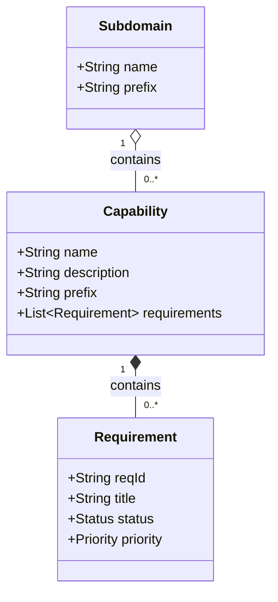

# Capability

A functional grouping within a subdomain that contains related requirements.

## Diagram



## Attributes

| Attribute | Type | Required | Description |
|-----------|------|----------|-------------|
| name | String | Yes | Capability name |
| description | String | No | Detailed description of what this capability provides |
| prefix | String | Yes | 3-letter code used in ReqIDs (e.g., GRD, ELG) |

## Relationships

| Relation | Target | Type | Description |
|----------|--------|------|-------------|
| Subdomain | [Subdomain](subdomain.md) | many-to-one | Parent subdomain |
| Requirement | [Requirement](requirement.md) | one-to-many | Requirements within this capability |

## Airtable Reference

- **Table ID**: `tblWYGS1TKBdXddAa`
- **Table Name**: Capability

## Purpose

Capability provides the second level of the ReqID prefix. It represents a specific functional area or feature set that the system provides.

The hierarchy flows: **Domain → Subdomain → Capability → Requirement**

## Prefix Convention

The prefix should be:
- Exactly 3 uppercase letters
- Unique within the subdomain
- Memorable and related to the capability name

Examples:
- Grading → `GRD`
- Eligibility → `ELG`
- Notifications → `NTF`
- Authentication → `AUT`

## ReqID Formation

Combined with the subdomain prefix, the capability prefix forms the first two parts of a ReqID:

```
[Subdomain Prefix]-[Capability Prefix]-[Number]
        ADM      -       GRD        -   001
```

This creates unique, traceable requirement identifiers like `ADM-GRD-001`.
