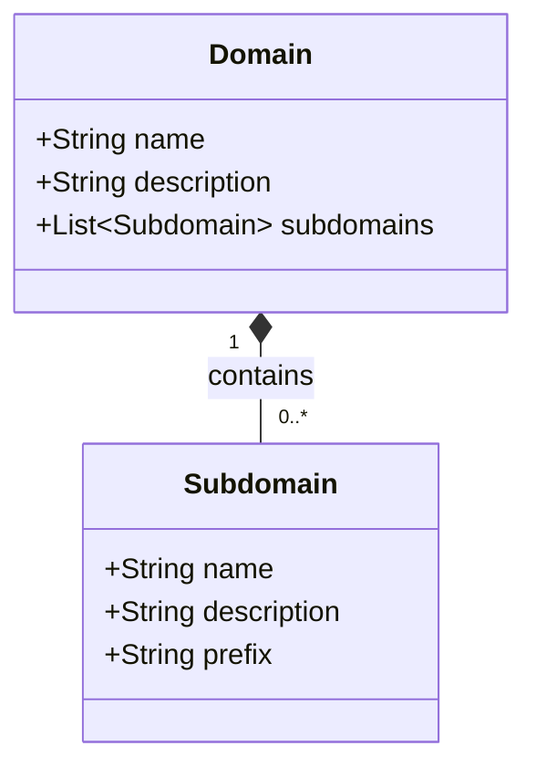

# Domain

The top-level organizational unit representing a major area of the product.

## Diagram

## Attributes

| Attribute | Type | Required | Description |
|-----------|------|----------|-------------|
| name | String | Yes | Domain name |
| description | String | No | Detailed description of the domain's scope |

## Relationships

| Relation | Target | Type | Description |
|----------|--------|------|-------------|
| Subdomain | [Subdomain](subdomain.md) | one-to-many | Subdomains within this domain |

## Airtable Reference

- **Table ID**: `tblMFLnoYL97hBQVN`
- **Table Name**: Domain

## Purpose

Domain is the highest level of organization in the requirements hierarchy. It groups related subdomains together and provides a broad categorization of product functionality.

The hierarchy flows: **Domain → Subdomain → Capability → Requirement**
