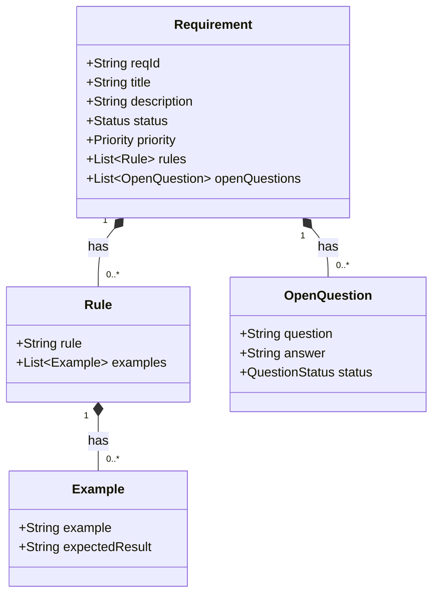

# Requirement (Aggregate)

A BDD requirement representing a specific behavior or capability that the system must provide.

## Aggregate Structure

## Attributes

| Attribute | Type | Required | Description |
|-----------|------|----------|-------------|
| reqId | String | Yes | Unique identifier (format: SUB-CAP-NNN) |
| title | String | Yes | Short descriptive title |
| description | String | No | Detailed description of the requirement |
| status | Status | Yes | Current lifecycle status |
| priority | Priority | Yes | MoSCoW prioritization |

### Status (Enum)

| Value | Description |
|-------|-------------|
| Draft | Initial creation, not yet reviewed |
| Review | Under review by stakeholders |
| Approved | Accepted and ready for implementation |
| Implementing | Currently being developed |
| Done | Fully implemented and verified |
| Deprecated | No longer applicable |

### Priority (Enum) - MoSCoW

| Value | Description |
|-------|-------------|
| Must | Critical - must be delivered |
| Should | Important - should be delivered if possible |
| Could | Desirable - nice to have |
| Wont | Out of scope for current iteration |

## Nested Entities

### Rule

Business rules that define the behavior of the requirement.

| Attribute | Type | Required | Description |
|-----------|------|----------|-------------|
| rule | String | Yes | Business rule statement |

### Example

Concrete examples that illustrate a rule (BDD Example Mapping).

| Attribute | Type | Required | Description |
|-----------|------|----------|-------------|
| example | String | Yes | Specific scenario or input |
| expectedResult | String | Yes | Expected outcome |

### OpenQuestion

Unresolved questions that need clarification.

| Attribute | Type | Required | Description |
|-----------|------|----------|-------------|
| question | String | Yes | The question to be answered |
| answer | String | No | The answer once resolved |
| status | QuestionStatus | Yes | Open, Answered, or Closed |

## Relationships

| Relation | Target | Type | Description |
|----------|--------|------|-------------|
| Capability | [Capability](capability.md) | many-to-one | The capability this requirement belongs to |
| BacklogItem | [BacklogItem](backlog-item.md) | one-to-many | Work items that implement this requirement |

## Airtable Reference

| Entity | Table ID |
|--------|----------|
| Requirement | `tbleIQR974abGisAd` |
| Rule | `tblPX7sj6GcsaPsVi` |
| Example | `tblcBFoUfTWHDsqrz` |
| OpenQuestion | `tbl1gRhS2mkF738Yg` |

## ReqID Format

The ReqID follows the pattern `SUB-CAP-NNN`:
- **SUB**: 3-letter Subdomain prefix
- **CAP**: 3-letter Capability prefix
- **NNN**: Sequential number (001, 002, etc.)

Example: `ADM-GRD-001` = Admin subdomain, Grading capability, requirement #1
