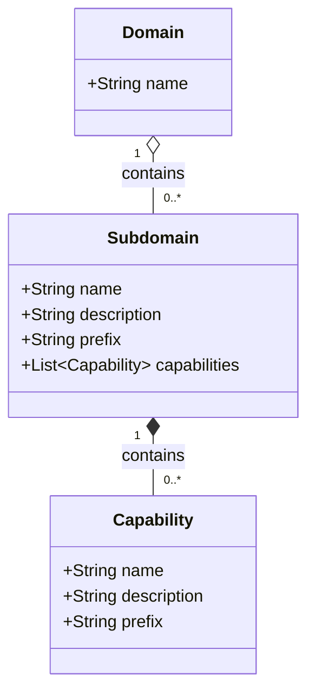

# Subdomain

A sub-area within a domain that groups related capabilities together.

## Diagram

## Attributes

| Attribute | Type | Required | Description |
|-----------|------|----------|-------------|
| name | String | Yes | Subdomain name |
| description | String | No | Detailed description of the subdomain's scope |
| prefix | String | Yes | 3-letter code used in ReqIDs (e.g., ADM, ENR) |

## Relationships

| Relation | Target | Type | Description |
|----------|--------|------|-------------|
| Domain | [Domain](domain.md) | many-to-one | Parent domain |
| Capability | [Capability](capability.md) | one-to-many | Capabilities within this subdomain |
| Entity | Entity | one-to-many | Domain entities belonging to this subdomain |
| Process | Process | one-to-many | Business processes in this subdomain |
| Glossary | Glossary | one-to-many | Terms defined in this subdomain |

## Airtable Reference

- **Table ID**: `tblG0harEr3mEIGPu`
- **Table Name**: Subdomain

## Purpose

Subdomain provides the first level of the ReqID prefix. It groups related capabilities and also contains domain modeling elements (entities, processes, glossary terms).

The hierarchy flows: **Domain → Subdomain → Capability → Requirement**

## Prefix Convention

The prefix should be:
- Exactly 3 uppercase letters
- Unique within the domain
- Memorable and related to the subdomain name

Examples:
- Admin → `ADM`
- Enrollment → `ENR`
- Reporting → `RPT`
